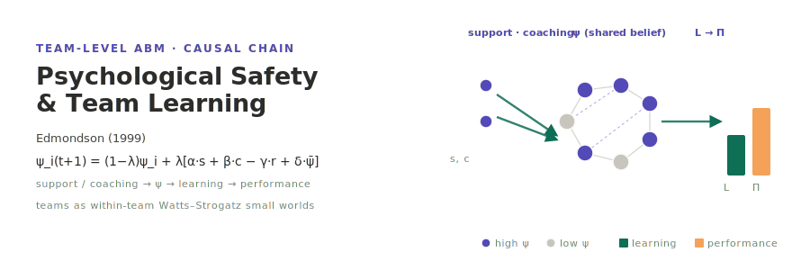

<p align="center"></p>

[English](README.md) | **日本語**

# Edmondson (1999) — 心理的安全性とチーム学習

**Edmondson (1999)「Psychological Safety and Learning Behavior in Work Teams」**(*Administrative Science Quarterly*, 44(2), 350–383; DOI: 10.2307/2666999)のチームレベル・エージェントベース再現実装である．

原著のフィールド調査を，その因果連鎖を **動的なエージェントベースモデル (ABM)** として再構成する．

```
コンテクスト支援 / リーダーコーチング  →  ψ (チーム心理的安全性)  →  学習行動 L  →  チームパフォーマンス Π
```

各個人は固定のチームに所属し，**チーム内 Watts–Strogatz** スモールワールドネットワーク (チーム横断辺は無し) 上に配置される．毎ステップ socsim の 6 フェーズループで 6 つのメカニズムを実行する．**コア** は心理的安全性の差分方程式である．

```
ψ_i(t+1) = (1−λ)·ψ_i + λ·[ α·s_k + β·c_k − γ·1[報復] + δ·ψ̄_{−i,k} ]
```

`--decision-mode` で **排他的** な 2 つの発言判断メカニズムを切り替える．

- `rule` (既定) — 決定論的な発言ロジット `σ(β0 + β_ψ·ψ − β_f·f − β_θ·θ − β_c·c)`．LLM 呼び出しゼロ・bit 単位で再現可能．
- `llm` — LLM (`socsim-llm`，Ollama 第一候補 → OpenAI フォールバック) が個人の内的状態とチーム文脈から VOICE/SILENCE と学習行動を決定する．

チーム学習 `L_k` はチーム内の発言 / 援助要請 / エラー議論の回数を集約する．チームパフォーマンスは `Π_k = γ_L·L_k + γ_K·K_k + N(0, σ_obs²)`．本モデルはシミュレートされたチーム横断データ上で原著の Baron & Kenny (1986) 媒介分析と ICC のアンカーを再構成する．

## 二層の決定論

- **決定論的な socsim コア** — 個人初期化・チーム内ネットワーク生成・スケジューリング・LLM を使わない 5 つのメカニズム．シードを固定すれば `rule` モードは bit 単位で再現する．
- **非決定的な LLM レイヤ** — `voice_decision` メカニズムのみ．`socsim-llm` の `CachingClient` (`hash(prompt+model)` → 応答キャッシュ)・`temperature=0`・`(agent_id, t)` 由来の固定シードで擬似決定論化する．再現性の担保はモデルではなくキャッシュが行う．

各実行は `llm_meta.json` に decision-mode / model / endpoint / temperature / seed / キャッシュヒット率を記録する．

## インストールとクイックスタート

```bash
# Rust シミュレーションをビルド (socsim を取得．Ollama+OpenAI バックエンドの socsim-llm を含む)．
cargo build --release

# === ベースライン再現 (rule モード・LLM 不要) ===
cargo run --release -- run \
    --n-teams 90 --team-size 8 \
    --lambda 0.10 --alpha 0.30 --beta 0.25 --gamma 0.50 --delta 0.35 \
    --network-model watts-strogatz --network-k 6 --network-beta 0.15 \
    --t-max 24 --runs 30 --seed 1999

# === §5 較正アンカーとの試行平均レポート ===
cargo run --release -- reproduce --decision-mode rule --runs 30 --seed 1999

# === 感度分析 (α × δ) ===
cargo run --release -- sweep \
    --alpha-min 0.10 --alpha-max 0.50 --alpha-step 0.05 \
    --delta-min 0.10 --delta-max 0.60 --delta-step 0.10 \
    --n-teams 90 --runs 30 --seed 1999

# === LLM 駆動 ablation (Ollama 第一候補) ===
#   ollama pull llama3.1
export OLLAMA_HOST=http://localhost:11434
export OLLAMA_MODEL=llama3.1
cargo run --release -- run --decision-mode llm \
    --cache-path runs/edmondson_cache.json \
    --n-teams 90 --runs 10 --seed 1999

# Python 可視化・分析ツール (workspace ルート)
uv sync
uv run edmondson-tools visualize                 # ψ/L/Π 時系列 + 媒介散布図 + ICC 推移
uv run edmondson-tools visualize-sweep           # α × δ の媒介 / R² / ICC ヒートマップ
uv run edmondson-tools show-experiment-settings  # config / sweep_config / llm_meta
uv run edmondson-tools reproduce                 # Table 4-8 風 Baron & Kenny レポート + ブートストラップ CI
```

## リポジトリ構成

```
edmondson1999/
├── simulation/                       # Rust socsim ABM
│   ├── Cargo.toml                    # socsim-{core,engine,net,metrics,llm,results} git 依存
│   ├── src/
│   │   ├── lib.rs / main.rs          # CLI: run / sweep / reproduce
│   │   ├── config.rs                 # Config / DecisionMode / PsiParams / VoiceBeta / NetworkKind
│   │   ├── world.rs                  # TeamWorld + Individual + Team
│   │   ├── mechanisms.rs             # 6 メカニズム × 6 フェーズ; rule と LLM の判断は排他
│   │   ├── prompts.rs                # 発言判断プロンプト + 判断 JSON パーサ
│   │   ├── llm.rs                    # socsim-llm 共有ハーネスの re-export shim
│   │   ├── simulation.rs             # init_world + run_with_client + CSV/JSON ライタ + アンカー
│   │   └── metrics.rs                # ICC + OLS + Baron & Kenny 三段階法 (論文固有)
│   └── tests/integration_test.rs     # rule bit 決定論 + scripted-LLM スモーク
├── tools/                            # Python edmondson-tools
│   └── src/edmondson_tools/{cli,visualize,visualize_sweep,show_experiment_settings,
│                            reproduce_paper}.py
├── docs/                             # bilingual: architecture, cli, usecases, visualization, reproduction
└── results/                          # 実行時生成 (gitignore)
    ├── latest -> {YYYYMMDD_HHMMSS}/
    └── {YYYYMMDD_HHMMSS}/
        ├── config.json | sweep_config.json
        ├── teams.csv                # t, team_id, psi, learning, performance, efficacy, support, coaching
        ├── individuals.csv          # t, team_id, agent_id, psi_i, voice, fear, retaliated
        ├── metrics.csv              # t, icc_psi, icc_learning, mediation_ratio, beta_psi_l, beta_l_pi
        ├── team_cross_section.csv   # チーム別の後半平均をプール (1 行 = 1 チーム × 1 試行)
        ├── sweep_summary.csv        # sweep: 1 行 = (α, δ, run)
        └── llm_meta.json            # LLM 来歴 + キャッシュヒット + 決定論ノート
```

## ドキュメント

- [アーキテクチャ](docs/architecture.ja.md) — ワールド状態，6 メカニズム × 6 フェーズ表，二層の決定論
- [CLI リファレンス](docs/cli.ja.md) — `run` / `sweep` / `reproduce` のフラグ
- [ユースケース](docs/usecases.ja.md) — ベースライン・sweep・LLM ablation のワークフロー
- [可視化](docs/visualization.ja.md) — Python ツールの出力
- [再現](docs/reproduction.ja.md) — モデルと Edmondson 1999 の数値の対応

## 参考文献

- Edmondson, A. C. (1999). Psychological Safety and Learning Behavior in Work Teams. *Administrative Science Quarterly*, 44(2), 350–383.
- Baron, R. M., & Kenny, D. A. (1986). The moderator–mediator variable distinction in social psychological research. *Journal of Personality and Social Psychology*, 51(6), 1173–1182.
- シミュレーション基盤: [socsim (rs-social-simulation-tools)](https://github.com/akitenkrad/rs-social-simulation-tools).

## ライセンス

MIT — [LICENSE](LICENSE) を参照．

---
*This file was generated by Claude Code.*
